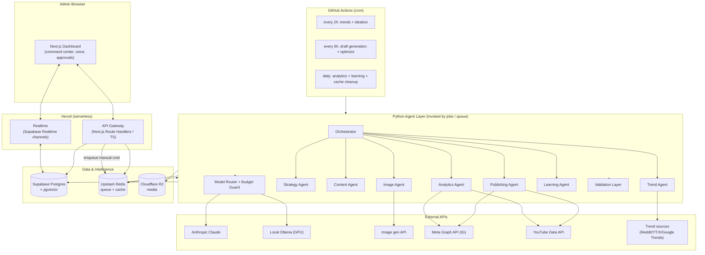

# AICOS — AI Autonomous Content Operating System

## MVP Design & Architecture Document (v1, for review)

> Status: **Draft for approval.** No application code is written yet. This document is the agreed design we will build against. Decisions below reflect the choices made during scoping (see "Locked Decisions").

---

## 1. Locked Decisions (from scoping)

| Area | Decision |
|---|---|
| **Scope** | Lean MVP: Dashboard + Trend agent + Content generation + Posting + Analytics + basic Voice |
| **Hosting** | Ultra-lean serverless: **Vercel** (frontend + API functions) + **GitHub Actions cron** (scheduled agent jobs). No always-on backend. |
| **Languages** | Polyglot: **TypeScript** (frontend, API gateway, light orchestration) + **Python** (AI agents) |
| **Datastores** | **Supabase Postgres + pgvector**, **Upstash Redis**, **Cloudflare R2**. (MongoDB & Pinecone dropped for MVP.) |
| **Platforms** | **Instagram + YouTube** first |
| **Publishing posture** | **Human-in-the-loop**: AI drafts → admin approves → publish |
| **Voice** | Browser **Web Speech API** (free, no infra) |
| **AI provider** | **Anthropic Claude** (Haiku = mid-tier, Sonnet/Opus = premium) |
| **Tier-1 cheap tasks** | **Local Ollama models** (user has a GPU) for classify/summarize/tag/dedupe |
| **Media** | Text + **AI image** generation. **Video deferred.** |
| **Posting integration** | Native **Meta Graph + YouTube Data** APIs in dev/tester mode, behind a swappable `PublisherProvider` interface |
| **Auth** | Single admin (Supabase Auth, email/magic link). Role system deferred. |
| **Brand/niche** | Configurable in DB (`brand_profiles`), not hardcoded |

---

## 2. Guiding Principles (from the PRD's cost philosophy)

These are **hard rules** the architecture enforces, not aspirations:

1. **Event/cron-triggered only** — no always-on AI loops. Agents wake on a schedule, an admin command, or a threshold event, then exit.
2. **Model-tier routing** — cheapest capable model wins. Local Ollama → Claude Haiku → Claude Sonnet → Claude Opus, escalating only when justified.
3. **Cache before regenerate** — prompts, outputs, trend reports, embeddings, hashtag sets, and platform rewrites are cached (Redis + Postgres). Identical tasks never re-hit a paid model.
4. **Retrieve before generate (RAG)** — search prior successful posts / templates / brand memory in pgvector and inject context before any generation.
5. **Deterministic pipelines over autonomous chains** — structured multi-step workflows with validation checkpoints. No recursive agent conversations or unbounded reasoning.
6. **Token budget guardrails** — per-agent / per-day / per-month budgets with automatic downgrade (premium → cheap → cached → pause).
7. **Queue everything heavy** — all expensive ops flow through a queue to smooth spikes and enable retries.
8. **ROI per call** — every premium call must justify itself; default to cheap/local.

**Target cost envelope:** ~$100–500/month at MVP.

---

## 3. High-Level Architecture



### Why this shape
- **No long-running servers.** Vercel functions handle synchronous API/UI needs; GitHub Actions cron + a lightweight queue handle all heavy/async AI work. This is what keeps idle cost near zero.
- **Realtime without a socket server.** We use **Supabase Realtime** (Postgres change streams) instead of running our own WebSocket server, satisfying the "live dashboard" requirement without always-on infra.
- **Agents are stateless invocations.** A GitHub Action (or a queue consumer it spawns) runs the Python agents to completion and exits. State lives in Postgres/Redis/R2, never in process memory.

---

## 4. System Layers (mapped to PRD)

| PRD Layer | MVP Implementation |
|---|---|
| L1 Frontend Dashboard | Next.js + React + Tailwind + shadcn/ui + Framer Motion; Recharts for analytics; Web Speech API for voice |
| L2 API Gateway | Next.js Route Handlers (TS) on Vercel; Supabase Auth (JWT); Zod validation; enqueues jobs to Redis |
| L3 AI Agent Layer | Python agents (FastAPI-style modules) triggered by GitHub Actions / queue; deterministic pipelines; no CrewAI/AutoGen autonomy initially |
| L4 Data & Intelligence | Supabase Postgres (relational + audit), pgvector (memory/RAG), Upstash Redis (queue/cache), R2 (media) |
| L5 Automation & Integration | `PublisherProvider` → Meta Graph (IG) + YouTube Data API; analytics ingestion via same APIs |

> **Deferred from PRD for MVP (with placeholders so they slot in later):** MongoDB, Pinecone/Weaviate, dedicated WebSocket/NestJS gateway, Kubernetes, video agent, voice auth/voiceprint, full RBAC, Grafana/Prometheus/ELK, multi-tenant SaaS, AI avatars/voice cloning, reinforcement learning.

---

## 5. The Cost-Control Subsystem (core differentiator)

### 5.1 Model Router
A single `ModelRouter` is the **only** way agents call a model. It selects a tier by task type and current budget state:

| Task | Default tier | Provider |
|---|---|---|
| Classification, tagging, summarization, dedupe, sentiment, metadata, formatting | **Tier 1** | Local Ollama (e.g. Llama 3 8B / Phi / Mistral) |
| Trend classification / clustering | **Tier 1 (embeddings)** | Local embeddings |
| Ideation, strategy refinement, caption cleanup | **Tier 2** | Claude Haiku |
| Final high-value content, viral optimization, long-form | **Tier 3** | Claude Sonnet/Opus (rate-limited, approval-gated) |

### 5.2 Budget Guard
- Tracks tokens **per agent / per workflow / per platform / per day / per month** in `ai_usage`.
- Admin sets daily/monthly/per-agent/per-platform limits in `budgets`.
- **Auto-downgrade ladder** when a threshold is hit: premium→cheaper model → reduce frequency → serve cached output → pause low-priority workflows → disable expensive optimizations. Each downgrade is logged and surfaced on the dashboard.

### 5.3 Cache Layers
- **Redis (hot):** prompt→output hashes, hashtag sets, platform rewrites, trend report TTLs.
- **Postgres/pgvector (warm):** embeddings, successful content, templates for RAG reuse.
- Cache key = hash(task_type + normalized_inputs + brand_id + model_tier). A hit short-circuits any paid call.

### 5.4 Validation Layer (runs on every generated piece)
Deterministic checks before content can be queued for approval: duplicate (embedding similarity), toxicity, platform char/format limits, basic SEO, grammar/readability, engagement score. Failures route back for a bounded single regeneration, then flag for human review — **never** an infinite loop.

---

## 6. Agents (MVP set)

Each agent is a pure function of its inputs + DB state, invoked by the orchestrator. Contracts are explicit so they're independently testable.

| Agent | Trigger | Inputs | Outputs | Models |
|---|---|---|---|---|
| **Orchestrator** | cron / manual command | job spec | sub-job dispatch, retries | none (deterministic) |
| **Trend** | every 2h | sources, brand niche | `trends` rows (topic, viral_score, opportunity_score) | Tier 1 classify + embeddings |
| **Strategy** | after trends | top trends, brand | `strategies` (angles, hooks, hashtags, format) | Tier 2 |
| **Content** | every 6h / manual | strategy, RAG context | `content_items` (draft caption/script + metadata) via outline→score→generate→optimize→validate | Tier 2 default, Tier 3 on high opportunity |
| **Image** | on content needing visual | content item, style preset | image in R2 + `media_assets` row | Image gen API |
| **Publishing** | on admin approval | approved item, schedule | platform post + `publications` row, retries | none |
| **Analytics** | daily | published items | `analytics` rows (likes/views/CTR/retention…) | Tier 1 summarize |
| **Learning** | daily | analytics history | prompt/timing/strategy tweaks (proposals, admin-gated) | Tier 1/2 |

### Multi-step content pipeline (precision + low hallucination)
`outline → score outline → generate → optimize → validate → queue for approval`. Cheap models do outline/score; premium only the final generate/optimize, and only when the opportunity score warrants it.

---

## 7. Workflow & Scheduling (GitHub Actions cron)

| Schedule | Job | Steps |
|---|---|---|
| Every **2h** | `trends.yml` | fetch trends → classify/score → store → enqueue ideation |
| Every **6h** | `content.yml` | pull top strategies → generate drafts (pipeline) → validate → mark `pending_approval` |
| **Daily** | `analytics.yml` | ingest platform metrics → summarize → run learning proposals → cache cleanup |
| On **push** | `deploy.yml` | build + deploy frontend/API to Vercel |
| **Manual** (admin command) | enqueue job in Redis | a short-lived consumer (Action `workflow_dispatch` or Vercel function) runs the requested agent |

> Heavy/manual commands from the dashboard are enqueued to Redis and executed by a `workflow_dispatch` Action run, keeping the request path fast and serverless.

---

## 8. Data Model (Postgres, MVP)

```
brand_profiles(id, name, niche, voice_json, platforms, created_at)
trends(id, brand_id, source, topic, raw_json, viral_score, opportunity_score, embedding vector, created_at)
strategies(id, brand_id, trend_id, angle, hooks_json, hashtags_json, target_platform, status, created_at)
content_items(id, brand_id, strategy_id, platform, type, body, metadata_json,
              quality_scores_json, status[draft|pending_approval|approved|rejected|scheduled|published|failed],
              embedding vector, created_at)
media_assets(id, content_item_id, kind[image], r2_key, prompt, style, created_at)
publications(id, content_item_id, platform, external_id, scheduled_for, published_at,
             status, error, retries)
analytics(id, publication_id, platform, metric_json, fetched_at)
ai_usage(id, agent, workflow, platform, model_tier, input_tokens, output_tokens, cost_estimate, created_at)
budgets(id, scope[global|agent|platform], scope_ref, daily_limit, monthly_limit)
prompt_templates(id, key, version, body, created_at)         -- centralized prompts
cache_entries(key, task_type, payload, expires_at)           -- warm cache mirror
audit_logs(id, actor, action, entity, detail_json, created_at)
commands(id, source[text|voice], raw, parsed_intent_json, status, created_at)  -- command console
admin_users(id, email, ...)                                  -- Supabase Auth backed
```
`embedding` columns use **pgvector** for RAG + duplicate detection.

---

## 9. Repository Layout (monorepo)

Adapts the PRD's structure to the lean serverless reality:

```
/apps
  /dashboard           # Next.js (frontend + API route handlers + Supabase Realtime)
/services              # Python agents (one package, modular)
  /agents
    orchestrator/  trend/  strategy/  content/  image/  publishing/  analytics/  learning/
  /core
    model_router.py  budget_guard.py  cache.py  validation.py  rag.py
  /integrations
    anthropic.py  ollama.py  image_gen.py  meta_graph.py  youtube.py  trend_sources.py
/packages
  /shared-types        # TS + generated types shared across app
  /prompts             # centralized prompt templates (versioned)
  /config              # env schema, model-tier config, budget defaults
/infrastructure
  /github-actions      # trends.yml, content.yml, analytics.yml, deploy.yml
  /supabase            # SQL migrations, RLS policies
/docs
  DESIGN.md (this file)  /architecture  /api  /workflows
```

---

## 10. Security & Auth (MVP)
- **Supabase Auth** single admin (email/magic link). All API routes require a valid session.
- **Secrets**: provider keys in Vercel + GitHub Actions encrypted secrets; never in repo.
- **RLS** on Supabase tables; service-role key only in server contexts.
- **Rate limiting** on API + premium-model calls.
- **Audit logging** of every agent action, AI decision, and admin command.
- Voiceprint/MFA/full RBAC are stubbed for a clean future upgrade.

---

## 11. Dashboard (UI) — MVP surfaces
1. **Command Center** — agent status (active/idle/failed), queue depth, token usage & live burn vs budget, latency.
2. **Command Console** — text + voice (Web Speech) natural-language commands → parsed intents → enqueued jobs.
3. **Content Pipeline** — Idea → Draft → **Pending Approval** → Scheduled → Published (Kanban). Approve/reject/edit here.
4. **Analytics Center** — per-platform metrics, viral scores, best-time-to-post, growth.
5. **Settings** — brand profile/voice, budgets, schedules, connected accounts.

Aesthetic per PRD: dark futuristic / glassmorphism / neon, Framer Motion transitions, real-time widgets — but kept performant (mostly cached/incremental, real-time only where it matters).

---

## 12. Explicit MVP Exclusions (and where they slot back in)
Video agent, MongoDB, Pinecone, NestJS WebSocket gateway, Kubernetes, voiceprint auth, full RBAC, Grafana/Prometheus/ELK, RL learning loops, multi-tenant SaaS, AI avatars/voice cloning. Each maps to a clean extension point (provider interfaces, deferred layers) so Phase 2/3 don't require re-architecture.

---

## 13. Open Items / Risks to confirm during build
- **IG prerequisite:** the target Instagram account must be **Business/Creator linked to a Facebook Page** for the publishing API. Please confirm this exists (or we use the manual-export fallback until it does).
- **YouTube quota:** default Data API quota limits uploads/day — fine for MVP volume; flagged for monitoring.
- **Trend source TOS/keys:** Reddit/X/Google Trends access varies (official APIs vs. allowed scraping). We'll start with the most accessible (Reddit API + Google Trends + YouTube) and gate others behind availability.
- **Brand profile:** we'll seed one brand; you provide niche + voice samples when ready (configurable, non-blocking).

---

## 14. Build Phases (proposed, post-approval)
1. **Foundation** — monorepo, Supabase schema + migrations, Auth, dashboard skeleton, Realtime wiring, model router + budget guard + cache (with mocks).
2. **Trend + Content** — trend sources, scoring, RAG, multi-step content pipeline, validation, pipeline UI + approvals.
3. **Image + Publishing** — image gen, `PublisherProvider` (IG + YouTube), scheduling, retries.
4. **Analytics + Learning** — metric ingestion, analytics UI, learning proposals.
5. **Voice + polish** — Web Speech command console, futuristic UI pass, observability basics.

---

*End of v1. Please review Sections 1–5 and 13 especially — once you approve (or amend), I'll begin Phase 1.*
